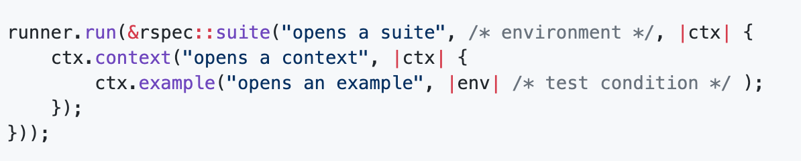
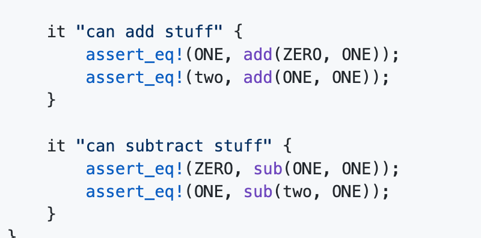
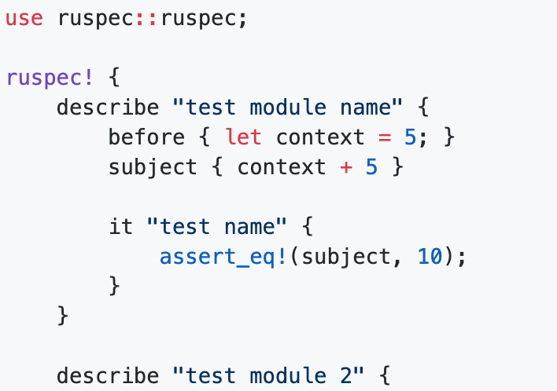

## proc_macro について

fukuoka.rs-vol.3

---

## About me

name: nasa (近藤アサン)

所属: 福岡工業大学 ３年

Twitter: @nasa_desu

GitHub: k-nasa

---

## 何となく Rspec が書きたくなった

Rust で！

- Rspec は簡潔で読みやすいテストコードが書ける
- before,subject などのブロックで囲むだけで共通部分が抜き出せて良い
- Rust ではちまちま型を書くのがだるい,,,

---

## 暇なので作ろう！

の前に既存のがありそうなので調べた (モチベーションに関わるので)

あるにはあったけど、、、

- rspec
- speculate

---

#### rspec

名前からして完璧!!と思ったけど

記法がみびょい

全部クロージャを渡す形



---

#### speculate

いい感じだった。けど



ビルドできない(かった)

---

#### では作るぞ！

というか作った



---

#### procedural_macros

- 手続き型マクロ
- 構文拡張
- コンパイラプラグイン

- 構文の抽象化における究極の柔軟性を可能に
- 斬新な方法で Rust を効率的に使用するための可能性を提供

https://github.com/rust-lang/rfcs/blob/master/text/1566-proc-macros.md

---

#### こんなやつ

```Cargo.toml
[lib]
proc_macro = true
```

```rust
#[proc_macro]
pub fn ruspec(input: proc_macro::TokenStream) -> proc_macro::TokenStream {
}
```

---

#### ちょっとだけ proc_macro の歴史を

- 昔の proc_macro は不安定
- AST ベースのため Rust を変更すると proc_macro が動かなくなる
- コンパイラの内部構造に依存
- proc_macro を保証できない or Rust を変更させられない

proc_macro2 から Token ベースになった

---

#### proc_macro2

function macro

```rust
#[proc_macro]
pub fn hoge(TokenStream) -> TokenStream;

hoge!
```

---

#### proc_macro2

attribute macro

```rust
#[proc_macro_attribute]
pub fn hoge(Option<TokenStream>, TokenStream) -> TokenStream;

#[hoge(a, b, c)]
```

#### proc_macro2

custom derive macro

```rust
#[proc_macro_derive]
pub fn hoge_derive(TokenStream) -> TokenStream;

#[derive(Hoge)]
struct Foo;
```
